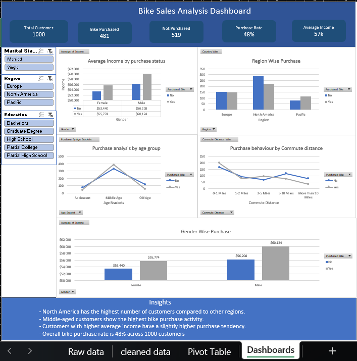
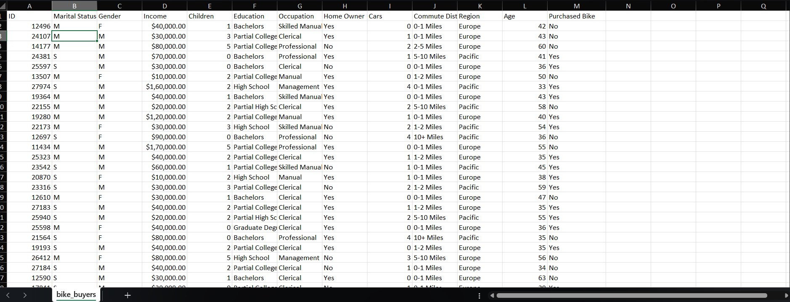
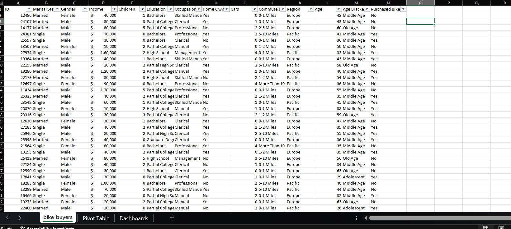
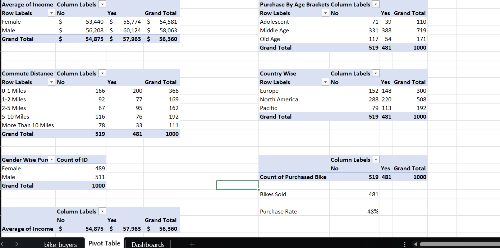

# Bike Sales Analysis Dashboard | Microsoft Excel

## Project Overview

This project focuses on analyzing customer purchasing behavior using Microsoft Excel. 
The objective was to clean raw customer data, perform analysis using Pivot Tables, and create an interactive dashboard to identify factors affecting bike purchases.

## Tools Used

- Microsoft Excel
- Pivot Tables
- Data Cleaning
- Data Visualization
- Dashboard Development

## Dataset Description

The dataset contains customer information including:

- Customer demographics
- Income
- Education
- Occupation
- Region
- Commute distance
- Bike purchase status

## Data Cleaning Process

Performed data preparation steps:

- Removed inconsistencies from raw data
- Standardized categorical values
- Organized data for analysis
- Prepared clean dataset for reporting

## Analysis Performed

Created Pivot Table analysis for:

- Average income comparison between bike buyers and non-buyers
- Region-wise purchase analysis
- Age group purchase behaviour
- Commute distance analysis
- Gender-wise purchase analysis

## Dashboard Features

The interactive dashboard includes:

- Total customers overview
- Bike purchase count
- Non-purchase count
- Purchase rate percentage
- Average income analysis
- Interactive slicers for filtering data

## Key Insights

- North America has the highest number of customers compared to other regions.
- Middle-aged customers show higher bike purchase activity.
- Customers with higher income show slightly higher purchase tendency.
- Overall bike purchase rate is 48% across 1000 customers.

## Project Screenshots

### Dashboard

### Raw Data

### Cleaned Data

### Pivot Tables

## Conclusion

This project demonstrates the process of transforming raw customer data into meaningful business insights using Excel analytics and dashboarding techniques.
